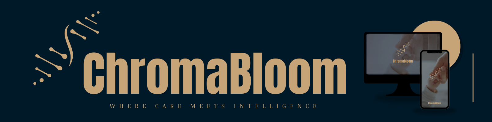

# ChromaBloom - Research Project

  

ChromaBloom is an applied research and system-development project that aims to build a personalized cloud-based AI platform to support the cognitive development of children with Down Syndrome while empowering their caregivers. The project integrates software engineering, AI/ML modelling, digital health design, and user-centered evaluation to create a unified tool tailored to the Sri Lankan special-needs community.

At its core, ChromaBloom addresses a major gap in Sri Lanka: families raising children with Down Syndrome often lack structured developmental tools, continuous progress tracking, and accessible emotional support for caregivers. The system provides a digital ecosystem that connects learning, routines, caregiver well-being, and predictive analytics into one cohesive platform.

ChromaBloom aims to become a pioneering AI ecosystem for neurodevelopmental support. By integrating cognitive learning, stress tracking, scheduling, and predictive analytics, it enhances day-to-day caregiving and improves the quality of life for families of children with Down Syndrome.

## 📃 Overall system architechture

  

## 🧩 Core System Components

| Component | Description |
|----------|-------------|
| **Interactive Visual Task Scheduler** | • Helps caregivers create, manage, and guide daily routines using visual cues. • Supports structure, consistency, and behavioral improvement. |
| **Gamified Knowledge Builder** | • Provides age-appropriate learning activities for children. • Tracks attention, motor skills, memory, and problem-solving skills. |
| **Cognitive Profiling & Prediction** | • Uses behavioral data and activity performance to predict developmental progress. • Helps caregivers understand how the child is improving over time. |
| **Caregiver Stress Monitoring & Support System** | • Tracks stress using journaling, digital wellbeing data, and mood inputs. • Generates personalized, evidence-based recommendations to reduce burnout. |

## Research Purpose
This research aims to develop and evaluate an AI-driven digital ecosystem that supports both children with Down Syndrome and their caregivers by:
- Enhancing cognitive engagement through personalized, interactive learning experiences  
- Reducing caregiver stress using emotional tracking and digital wellbeing insights  
- Providing structured and adaptive daily routine management  
- Delivering data-driven cognitive progress predictions to aid early intervention 

## Methodology
The project follows a rigorous, ethical, and user-centered approach that includes:
- **Mixed-method data collection** combining qualitative and quantitative inputs  
- **Non-invasive behavioral and emotional metrics** gathered through app interactions  
- **AI/ML models** for personalization, stress analysis, and developmental prediction  
- **Strict ethical protocols**, including informed consent, anonymization, and secure encrypted data storage

## 🔗 ChromaBloom Dependencies

| Category | Technologies / Tools | Purpose |
|--------|----------------------|---------|
| **Frontend (Mobile App)** | Flutter, Dart, Material UI, SharedPreferences, HTTP | Builds the caregiver-facing mobile application and handles UI, local storage, and API communication |
| **Backend & API Services** | Node.js, Express.js, MongoDB, Mongoose, JWT, bcrypt, dotenv | Manages authentication, business logic, secure APIs, and data storage |
| **AI / Machine Learning** | Python, Scikit-learn, LightGBM, TensorFlow, Keras, Pandas, NumPy, SHAP | Enables cognitive profiling, stress analysis, predictive modeling, and model explainability |
| **Cloud & Storage** | MongoDB Atlas, Cloudinary, REST APIs | Provides scalable database hosting, secure image storage, and service communication |
| **Security & Ethics** | Data Encryption, Anonymization, Role-based Access Control, Consent-based Data Collection | Ensures participant privacy, ethical compliance, and secure access management |
| **Development & Collaboration** | Git, GitHub, Postman, Google Colab, VS Code, Android Studio | Supports version control, API testing, ML training, and development workflows |
| **Device & OS (Optional)** | Android SDK, ADB, Web Browser | Enables mobile deployment, device debugging, and optional web access |

## 🏷️ Expected Outcomes
- Improved developmental routines and learning efficiency  
- Reduced caregiver stress and burden  
- AI-powered cognitive progress predictions  
- A scalable digital health solution for Sri Lanka and beyond

## 👥 Research Team

| Name | Role | GitHub |
|------|------|--------|
| **J.A.I.S. Wijesundara** | Principal Researcher / Team Lead | [@Ishara184](https://github.com/Ishara184) |
| **A.M.O.M. Chathurangi** | Researcher | [@OshiMC](https://github.com/OshiMC) |
| **A.D.S.S. Wijerathna** | Researcher | [@Susinidu4](https://github.com/Susinidu4) |
| **M.Y.P. Perera** | Researcher | [@YASSA2001](https://github.com/YASSA2001) |

---
